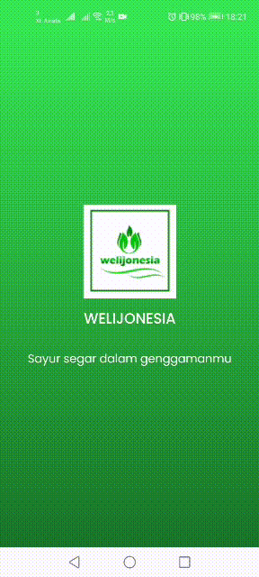

<h1 align="center">
   
</h1>

## Important

Aplikasi ini sedang dalam tahap pengembangan, aplikasi ini merupakan versi 2 dari aplikasi sebelumnya dimana akan memiliki beberapa fitur baru kedepannya dengan teknologi terkini.
 Beberapa fitur baru akan segera diperbarui.

## Welijonesia

Welijonesia merupakan startup baru yang ada di kota jember, dimana mempertemakan antara Lijo dan Pembeli.

## Demo

  

## Fitur

- Choose Lijo (Seller)
- Create Trancation
- Realtime Maps
- Chatting
- Payment Gateway

## Kenapa Welijonesia?

- Mudah digunakan
- Cari bahan pokok dengan satu genggaman

## Tech Stack

- React Native for the Mobile Frontend
- Laravel for the Backend

### Support Us :)

- Stars this repository
- Hire Us

  - [Abdul Kholiq](https://www.linkedin.com/in/kholiq/)

  ## Contact

- WA/TELEGRAM: +6285959591196 (Abdul Kholiq)

